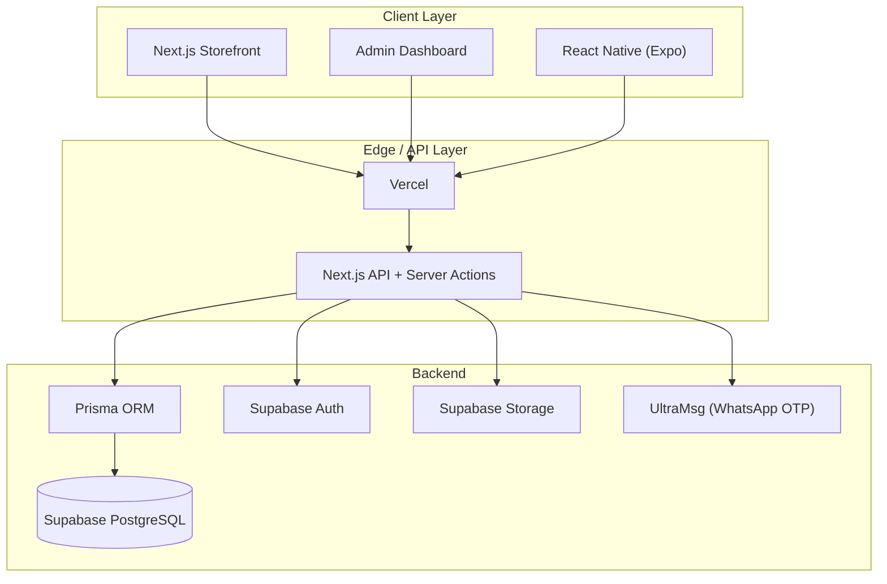
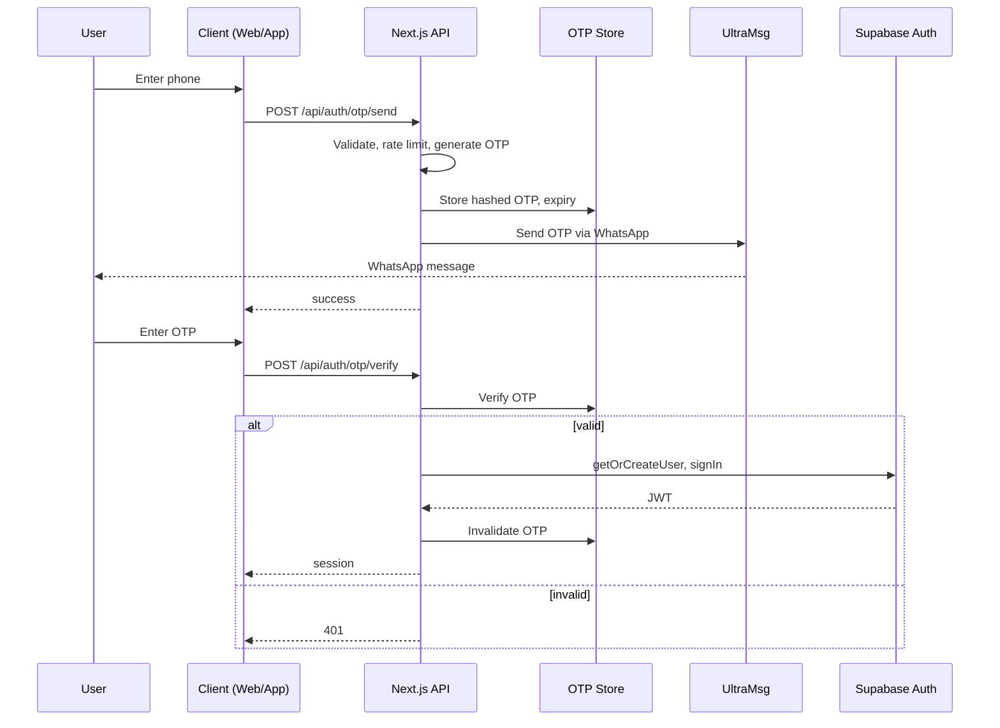
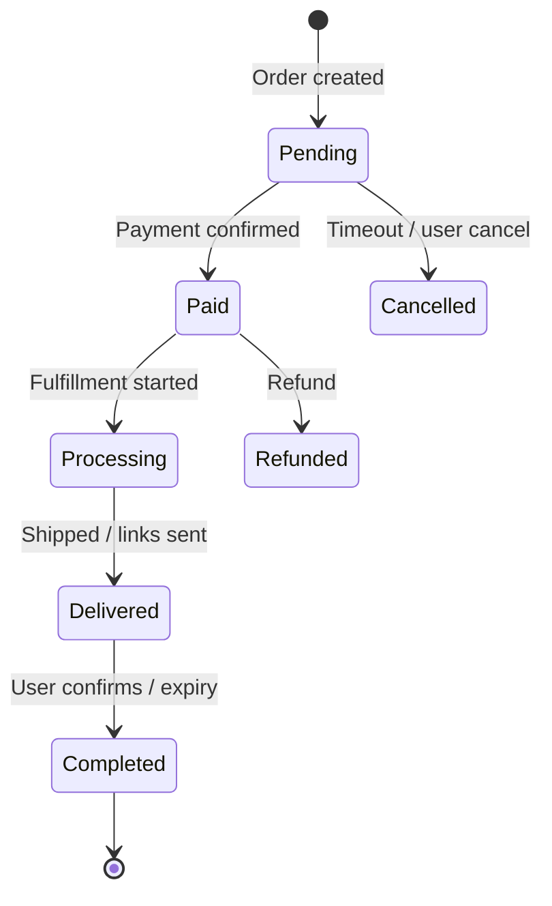
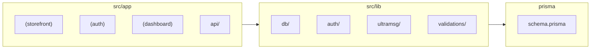

# Architecture Diagrams (Mermaid)

Standalone diagrams for documentation and presentations.

---

## High-Level System

---

## WhatsApp OTP Auth Flow

---

## Order Lifecycle (Digital + Physical)

---

## Folder Structure (Target)

These diagrams are also embedded in [SYSTEM_ARCHITECTURE.md](SYSTEM_ARCHITECTURE.md).
