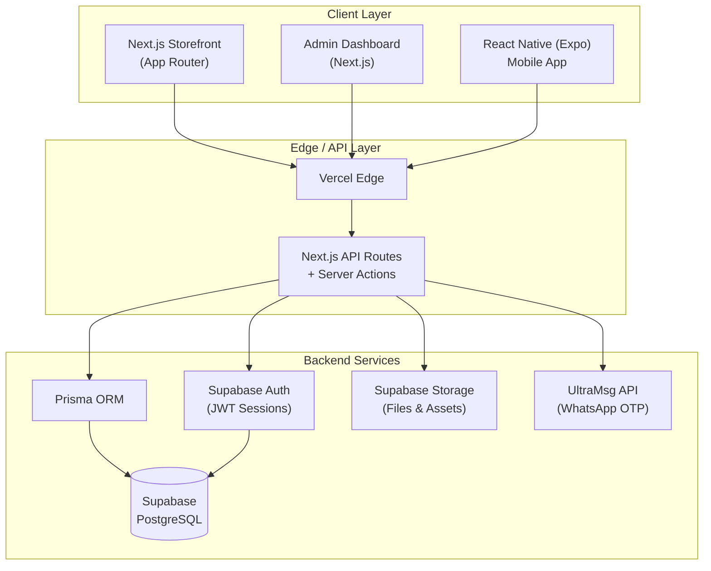
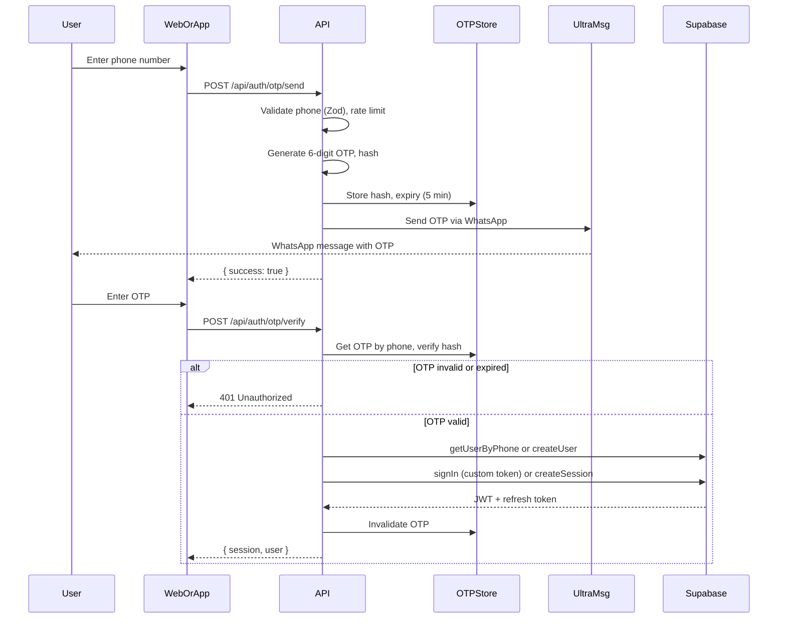
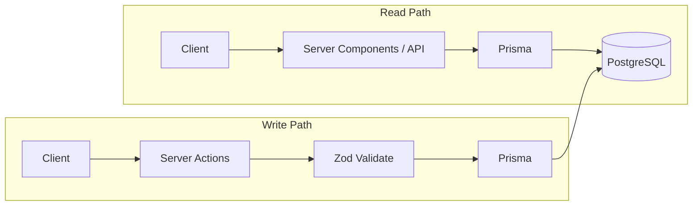
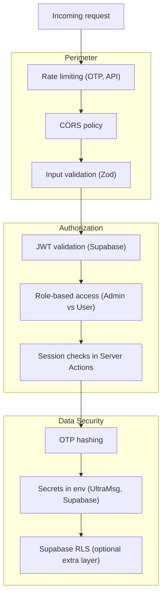
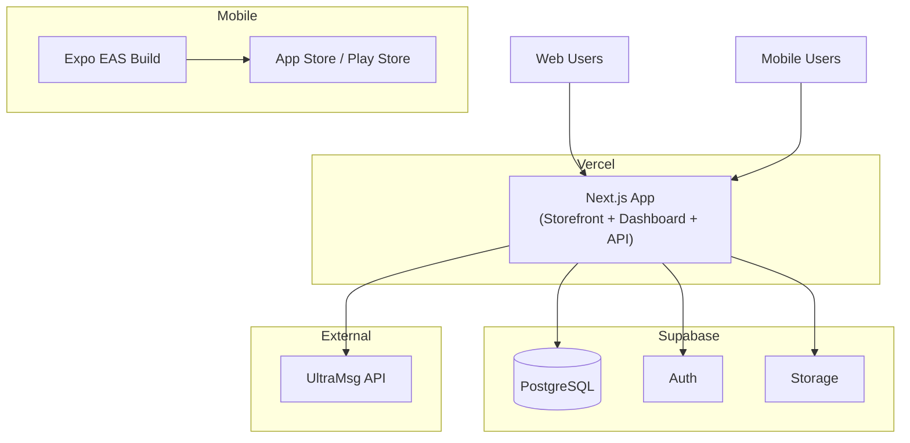

# Phase 1: System Architecture

## E-commerce Platform — Production Architecture

This document describes the system architecture for a scalable e-commerce platform supporting digital and physical products, WhatsApp OTP authentication, and multi-channel access (Web, Admin Dashboard, Mobile).

---

## 1. High-Level System Architecture



**Rationale:**

- **Single deployment (Vercel)** for web and dashboard reduces ops and keeps one API surface.
- **Prisma as API data layer** gives type-safe queries and migrations; Supabase remains the PostgreSQL host.
- **Supabase Auth** stores users and issues JWTs; we use custom OTP flow that then creates/updates Supabase users.
- **UltraMsg** is the only external dependency for sending OTP; all other auth state lives in Supabase.

---

## 2. Authentication Architecture (WhatsApp OTP)



**Security considerations:**

- OTP is **hashed** before storage (e.g. bcrypt or SHA-256 with server secret); never store plain OTP.
- **Rate limiting** on send and verify (e.g. 3 sends per phone per 15 min, 5 verify attempts per 15 min).
- **Expiry**: OTP valid for 5 minutes only.
- **Single use**: OTP is deleted after successful verification.
- **Phone format**: Normalize and validate (E.164) before sending.

---

## 3. Data Flow Architecture



- **Server Components** and **API routes** perform all Prisma reads; no Prisma client exposed to the browser.
- **Server Actions** handle mutations with **Zod** validation and optional CSRF protection (Next.js built-in for same-origin).
- **Prisma** is the single interface to Supabase PostgreSQL; Supabase Storage is used only for file upload/download URLs.

---

## 4. Component Breakdown

| Component | Responsibility | Tech |
|-----------|----------------|------|
| **Storefront** | Product listing, cart, checkout, digital downloads | Next.js 14 (App Router), Tailwind, shadcn/ui |
| **Admin Dashboard** | Product CRUD, orders, users, analytics, file upload | Next.js 14, same UI stack, role-based routes |
| **API Layer** | Auth (OTP send/verify), orders, products, webhooks | Next.js API routes + Server Actions |
| **Auth** | OTP generation, UltraMsg send, Supabase user create/sign-in, JWT | Custom API + Supabase Auth |
| **Database** | Users, OTPs, products, orders, assets, sessions | Supabase (PostgreSQL) via Prisma |
| **Storage** | Digital assets, product files, admin uploads | Supabase Storage |
| **Mobile App** | Browse, login via OTP, orders, downloads | React Native (Expo), same API + Supabase client |

---

## 5. Security Architecture



- **Perimeter**: Rate limiting on auth and critical APIs; strict CORS; Zod on all inputs.
- **Authorization**: Roles (e.g. `user`, `admin`) stored in DB and enforced in Server Actions and API routes; JWT from Supabase validated on each request.
- **Data**: OTP hashed; no secrets in client; Supabase credentials in env; RLS can be added for defense in depth.

---

## 6. Deployment Architecture



- **Vercel**: Hosts Next.js (storefront, dashboard, API, Server Actions). One project, multiple routes.
- **Supabase**: Managed PostgreSQL, Auth (JWT), Storage; connection string and keys in Vercel env.
- **UltraMsg**: Called from Next.js server only; API key in env.
- **Mobile**: Expo app consumes same Next.js API and Supabase; distributed via EAS and stores.

---

## 7. Folder Structure (Planned)

```
stor-ai/
├── src/
│   ├── app/                    # Next.js App Router
│   │   ├── (storefront)/       # Public store
│   │   │   ├── page.tsx
│   │   │   ├── products/
│   │   │   ├── cart/
│   │   │   └── checkout/
│   │   ├── (auth)/             # Login (OTP)
│   │   │   └── login/
│   │   ├── (dashboard)/        # Admin (protected)
│   │   │   ├── admin/
│   │   │   │   ├── products/
│   │   │   │   ├── orders/
│   │   │   │   └── users/
│   │   │   └── layout.tsx
│   │   ├── api/
│   │   │   ├── auth/
│   │   │   │   ├── otp/
│   │   │   │   │   ├── send/
│   │   │   │   │   └── verify/
│   │   │   │   └── session/
│   │   │   ├── webhooks/
│   │   │   └── ...
│   │   ├── layout.tsx
│   │   └── globals.css
│   ├── components/
│   │   ├── ui/                 # shadcn
│   │   ├── storefront/
│   │   ├── dashboard/
│   │   └── shared/
│   ├── lib/
│   │   ├── db/                 # Prisma client
│   │   ├── auth/
│   │   ├── ultramsg/
│   │   ├── supabase/
│   │   ├── validations/        # Zod schemas
│   │   └── utils/
│   ├── server/
│   │   ├── actions/            # Server Actions
│   │   └── middleware/
│   └── types/
├── prisma/
│   └── schema.prisma
├── docs/
│   └── architecture/
├── mobile/                     # Expo app (Phase 6)
└── public/
```

---

## 8. Phase Summary

| Phase | Deliverable | Status |
|-------|-------------|--------|
| 1 | System architecture (this doc) | Done |
| 2 | Database schema (Prisma) | Next |
| 3 | Auth (WhatsApp OTP) | Pending |
| 4 | Storefront UI | Pending |
| 5 | Admin dashboard | Pending |
| 6 | Mobile app | Pending |
| 7 | Deployment | Pending |

This architecture is designed for **scalability** (stateless API, managed DB and storage), **security** (OTP hashing, rate limits, RBAC, validation), and **maintainability** (single codebase for web/dashboard, type-safe Prisma, clear boundaries).
